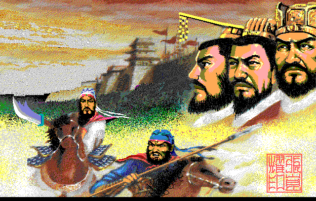
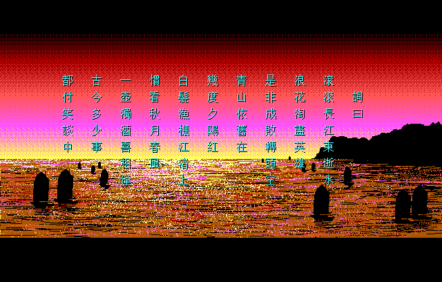
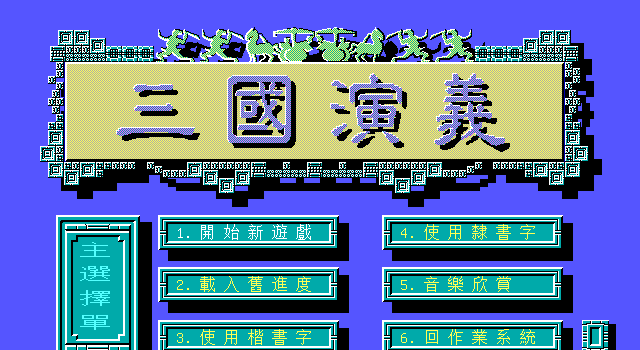
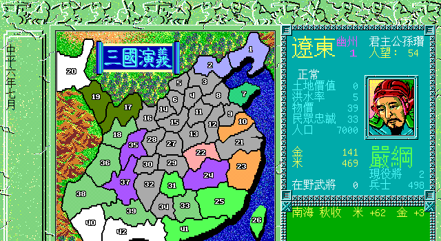
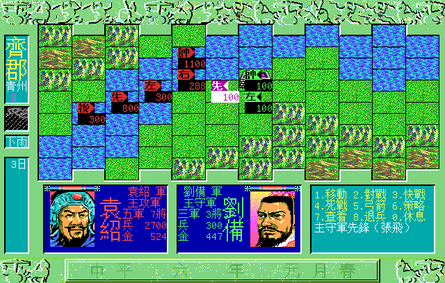
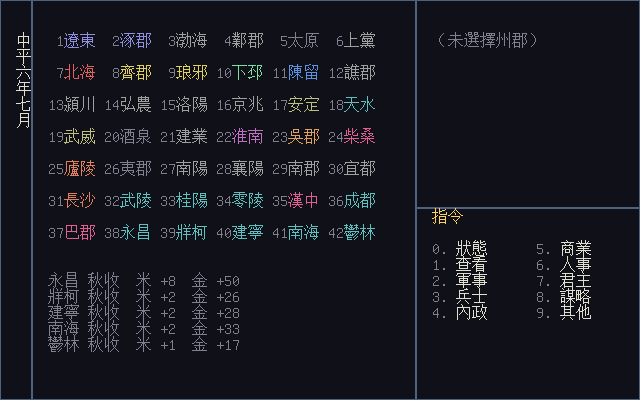

# 三國演義 DOS remake

智冠科技（Softworld）1991 年 DOS 遊戲《三國演義》的逆向工程重寫，
以 Go / Ebiten 實作跨平台引擎。定位是文化資產保存——這是台灣自製 PC 遊戲的早期作品。

原版與《三國演義1加強版》兩個版本並列還原，規則層共用，版本差異以旗標切換。

## 畫面



開機的第一張。原版把它切成四塊 160×400 的 `TITL0`–`TITL3` 存在 `DATA1`
裡，並排成 640 寬再取上面 350 列；remake 照同一個擺法拼回去，與原版
那一格 **224,000 格逐格相同**。



開場的〈臨江仙〉。底圖是原版的兩張 `SANTL`／`SANTR`，與原版還沒寫字的
那一格逐像素相同；詞的欄距、列距與顏色也是從原版量的，字用 remake
自己的字庫。



主選單。標題牌是原版的 `MENU0A`／`MENU0B`，六個按鈕是 `MENU2` 排成
兩欄三列——位置全部拿原版的畫面逐像素比對出來（標題牌兩塊 **100%**），
因為這一張的程式在開機鏈的第二層，主程式的碼段 dump 涵蓋不到。



主畫面。**圖像來自原版**——地圖、花邊、標題牌、右側面板與人物肖像都是
`DATA3` 裡的素材，執行時從玩家自己那一份讀進來，位置與原版相同
（`docs/spec/005`）：七張 `MAINMAP*` 拼成底圖，州郡從記錄裡的地圖座標
（`+0x50`／`+0x2c`）灌色，肖像畫在 (536,116)。配樂也是原版的，
從 `DATA1` 邊播邊合成。

州郡的填色也是原版的：`EGAFILL.PAL` 給十六個勢力各一塊 8×8 的圖樣
（四塊純色、十二塊兩色網點）。拿原版剛載完進度的畫面逐格比，
35 個有主的郡裡 34 個全中。

字是 remake 自己的字庫——**不內嵌任何原版字模**。

上圖是讓電腦跑六個月之後的中平六年七月，秋收正好落在這個月
（原版的四季常式一年各跑一次，分派器比的是月份 1／4／7／10）。



主戰場。圖塊是原版的——`EICON.GRP` 是三十六筆 48×32 的 `.IMG` 首尾相接，
**圖塊編號就是地形碼**。與原版紮完寨之後的畫面逐格比，78 格裡 73 格
逐像素全中，差的五格正是五支部隊站的位置。

部隊的旗也是原版的。四組 `WFLAG` 對上四個軍力（主守、助守、主攻、
助攻），旗面上印著帥、先、左、右、後——中軍、先鋒、左軍、右軍、後軍。
輪到下令的那一支畫成**反白**，與原版一樣是整面旗取顏色補數。

底紋、左欄的四個小框、下方三個面板、肖像與肖像框也都是照原版的座標
擺的，逐像素對得上。**攻方的肖像是左右翻的**，所以兩位統帥面對面——
這一點是拿原版的畫面比出來的：守方那張直接相符，攻方那張翻過來才相符。

上圖是齊郡（青州），袁紹軍攻、劉備軍守，開打第三天。
面板裡的字是 remake 自己排的，位置與字色照原版；指令列與提示同理。



`-art=false` 或讀不到 `DATA3` 時退回這一張。介面文字三個語系
（繁中原文／英／日）：人名與郡名走**字元層**換寫，英文用漢語拼音、
日文換新字體，346 位人物 ＋ 42 個郡用到的 426 個相異字都有涵蓋率測試盯著。

以上都是無頭產出的（`cmd/san1dump -png`），Ebiten 視窗走同一份畫面程式。

> 截圖裡的美術是原版的。這個儲存庫**不散布原版的執行檔、資料檔、
> 美術、音樂與字型**；截圖只為說明 remake 接上素材之後的樣子，
> 玩家要自備原版才跑得出這一張。

## 現在做到哪裡

**一局玩得完。** 開機走開場詞 → 主選單 → 選年代／選君主／選難度，
然後載入原版劇本、畫出主畫面、接受十類指令、讓電腦諸侯行動、
跑四季事件、打戰役、判勝負。全電腦對戰跑到分出勝負約需五十年遊戲時間。

主選單的六個項目照原版：開始新遊戲、載入舊進度、使用楷書字、
使用隸書字、音樂欣賞、回作業系統。字型那兩項 remake 做不到——
**不內嵌任何原版字模**——所以選了只會說明一句。

已實作：查看／軍事／兵士／內政／商業／人事／君主／謀略八類共二十餘個
指令、四季事件（老死、新血、地震、洪水、瘟疫、秋收、蝗害、人口成長、
進貢）、一統天下的勝負判定。

戰役兩層都做了。戰略層管誰打誰、贏了誰接手、被擒的將領怎麼處置；
戰術層是最多三十天的主戰場——六方向格子、九種地形、移動力與兵種適性、
五種戰鬥隊伍、快戰死戰、弓箭、單挑、六種計謀與天氣限制、退兵、缺糧逃亡、
卅天判定。戰場的地形版面是**原版的資料**——州郡記錄 offset 55–174 的 120 個位元組，
12 欄 × 10 列，42 個郡 42 張沒有兩張相同（`docs/spec/003` §3.3）。

存讀檔做了六個進度（說明書 p.25）。存出來的三張表**與原版的版面
逐位元組相同**，還沒解出來的欄位原封不動帶著走（`docs/formats/05`）。

主程式的介面字串表已經抽出來（`docs/re/04`），選單文字、欄位標籤、
計謀編號、每郡上限五十位將軍這些都以原版執行檔為準，不照手冊轉錄。
年月依原版可切中曆年號或西曆（其他 → 年號）。

戰役可以親自指揮：進主戰場，照原版的兩層指令下令（移動／對戰／快戰／
死戰／弓箭／策略／查看／退兵／休息），方向鍵盤也照原版的 `4 5 6 / 1 2 3`。
不想看的戰役交給電腦打完，逐日戰報留著隨時翻。

原版的六首配樂已經解出來（`docs/formats/06`）：`MUS.GRP`／`MUSV.GRP`
是巢狀容器，偶數項是曲子、奇數項是它的 AdLib 音色庫；曲子是 MIDI 事件流，
六首的事件數與表頭精準吻合。音色的 56 個位元組也解出來了——兩個運算子
各十三項，用原版自己填進 OPL2 的暫存器值回頭驗過。

所以遊戲**放得出原版的配樂**：`internal/music` 有一顆 OPL2，事件流照
AdLib 的聲部分配送進去邊播邊合成。音高也對過拍：原版播「思古」送出的
F-number 與 remake 逐次相同。

原版的點陣圖也解出來了（`docs/formats/07`）：613 張 `.IMG`／`.FAC`
全部同一個格式，表頭是高與寬、本體是四個位元平面。平面與顏色的對應
拿 dosgolem 跑出來的原版畫面逐像素比對確認——`F000.FAC` 與 `F005.FAC`
在君主選擇畫面上 **100% 相符**。

介面文字放在 `internal/i18n/lang/*.json`（繁中／英／日）——畫面、提示、
事件紀錄三層都走字串表。`tools/assets.sh` 把原版的圖轉成 PNG、劇本轉成
JSON、配樂轉成 OGG。

人名與郡名也翻得出來：英文走漢語拼音（`諸葛亮` → `Zhuge Liang`，
複姓與多音字有處理），日文換成新字體（`關羽` → `関羽`）。做法是**字元層**
不是逐個名字——346 位人物 ＋ 42 個郡用到 426 個相異字，涵蓋率有測試盯著。

電腦諸侯的十八張分派表讀出十六張，判斷式從碼讀出不是行為推測。
內政那張表的六個等級**對拍過了**——讓原版自己跑四個月、13 個勢力、
58 次內政，原版當場算出來的量與 remake 的公式逐次相同
（`docs/playtest/02`）。

對拍那一側，原版現在能在 dosgolem 裡從頭跑到主選單——`AA.EXE` →
`DATA0.GRP` → `DATA5.GRP` 三層 chain-load、`DATA1`／`DATA2`／`DATA3`
三組容器載入、EGA 640×350 畫面輸出，全程無頭、決定性。

```sh
# Ebiten 視窗：← → 選郡、0–9 指令、Enter 結束這個月、Esc 返回
# 存檔：其他（9）→ 儲存（2）→ 選一格；開場讀檔用 -load
tools/go.sh run ./cmd/san1 -root /path/to/三國演義 -faction 0 -ai enhanced \
    -saves ~/.local/share/san1-remake/saves

# 無頭：讓電腦跑 14 個月再把畫面存成 PNG
tools/go.sh run ./cmd/san1dump -root /path/to/三國演義 \
    -screen main -faction 0 -months 14 -png out.png
```

`-screen` 可以挑：`list`（州郡一覽）、`main`／`art`（主畫面，`art` 接原版
素材）、`title`（主選單）、`titleart`（開場的三英圖）、`poem`（開場詞）、
`artfield`（戰場地形）、`artbattle`（整張主戰場）、`battle`（文字版主戰場）。

電腦 AI 有三個版本：`base`（三國演義原版還原）、`plus`（加強版還原）、
`enhanced`（remake 強化）。前兩個只發已經從原版解出來的行為，
沒解出來的一律不做——**不會拿一個「差不多的」策略頂著**，
`Coverage()` 會把「十八張表解出幾張」講出來（`docs/design/01`）。

完成度的數字以 [`VERIFICATION-MATRIX.md`](VERIFICATION-MATRIX.md) 為準；
目前的實際狀態在 [`CONTEXT.md`](CONTEXT.md)。

| 里程碑 | 狀態 |
|---|---|
| M0 環境 ＋ 素材 | 完成 |
| M1 dosgolem 跑得動 | 完成：原版開機到主選單 |
| M2 容器格式 | 實質完成（`docs/formats/01`–`03`）|
| M3 文字與字型 | 完成：Big5 字串全抽出、CJK 畫布、字型涵蓋率有測試 |
| M4 靜態資料 | 完成：劇本三表、地圖圖形、資產目錄 |
| M5 規則層 | 完成：平時十類指令、四季事件、戰役決勝、勝負判定；電腦諸侯的十八張分派表逐位元組對齊。九份機制文件的「還缺什麼」欄全部結清 |
| M6 引擎可玩 | 完成：出口條件四段都對原版對拍過（開局盤面、一個月的狀態轉移、戰役逐日、存讀檔兩個方向）|
| M7 多語系 | 完成：畫面、提示、事件紀錄、人名、郡名，繁中／英／日 |
| M8 發行 | 出口條件達成：四個包逐位元組可重現、每包帶 LICENSE 與 README、Linux 包實跑驗過；簽章的管線寫好了但缺要申請的憑證 |

## 需要原版

本儲存庫**不含**任何原版檔案——執行檔、資料檔、美術、音樂、字型、說明書都不散布。
要跑起來得自備原版。

## 對拍到哪裡

規則不是「照手冊寫完就算」——每一條都要原版自己說一次。目前逐次
相同的有：

| 規則 | 等級 | 樣本 |
|---|---|---|
| 內政兩項 × 六個 AI 等級 | `L1` | 58 次 |
| 老死（過壽才扣體能）| `L1` | 21 次 |
| 蝗害的兩條損失 | `L1` | 16 次 |
| 君主繼承的人望折損 | `L1` | 3 次（跨四捨五入兩側）|

做法與踩過的坑寫在 [`docs/playtest/02`](docs/playtest/02-rule-parity.md)：
掛在原版寫回去的那道指令上、盤面自己擺不等劇本剛好給、
判準要列舉不要反推區間。

## 驗證方式

規則還原不以「在 remake 裡看起來能玩」驗收，而是對原版對拍：
用 [dosgolem](https://github.com/wicanr2/dosgolem)（無頭、決定性的 DOS 執行器）
在程序內跑原版執行檔，直接讀原版自己的變數、攔它自己的呼叫，逐項比對。
DOSBox-X 作為交叉驗證。

**局面由對拍這一方寫進原版的記憶體**，不靠原版自己的亂數湊——亂數帶著
自己的種子與呼叫次數，跑兩次不見得一樣，而且它一動整張盤面都會變，
比出來的差異就分不出是「決策不同」還是「盤面不同」。寫進去再讀回來
要逐位元組相同，所以「同一個局面」是驗過的不是假設的。

執行器是決定性的，這件事本身也是工具：從同一個快照展開多個變體，
噪音（游標閃爍那類）逐像素重現，扣掉之後對照組的差是零。

完成度與每一項的證據等級在 [`VERIFICATION-MATRIX.md`](VERIFICATION-MATRIX.md)。

## 授權

採 RRSAL-1.0（復古重製 source-available 授權條款），全文見 [`LICENSE`](LICENSE)。
非商業用途免費且寬鬆，包含修改與再散布、實況與影片；商業用途保留給著作權人另行洽談。

這不是 open source，是 source-available。

原版《三國演義》的著作權屬智冠科技，本專案與智冠科技無關。

## 文件

| 路徑 | 內容 |
|---|---|
| [`CLAUDE.md`](CLAUDE.md) | 專案規則與硬規則 |
| [`CONTEXT.md`](CONTEXT.md) | 現況、已知事實、決策紀錄、worklist |
| `docs/re/` | 反組譯筆記（含主程式的介面字串表）|
| `docs/formats/` | 檔案格式（含存檔、配樂、點陣圖）|
| `docs/spec/` | 規格（只有 `READY` 能授權實作）|
| `docs/mechanics/` | 遊戲機制（含中平六年開局的完整局面）|
| `docs/playtest/` | 對拍紀錄 |
| `docs/design/` | remake 自己的設計決策 |
| `cmd/san1turndiff` | 讀兩份原版執行期盤面，說出中間那個月動了什麼 |
| `docs/reference/` | 說明書整理、社群資料 |
